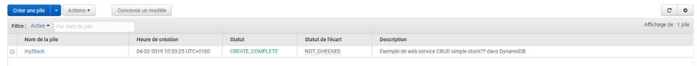
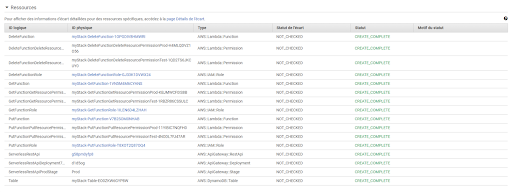
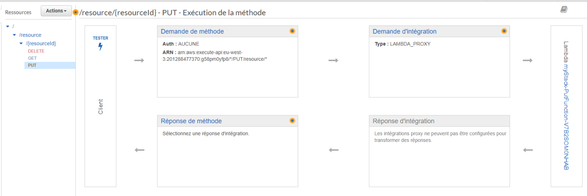
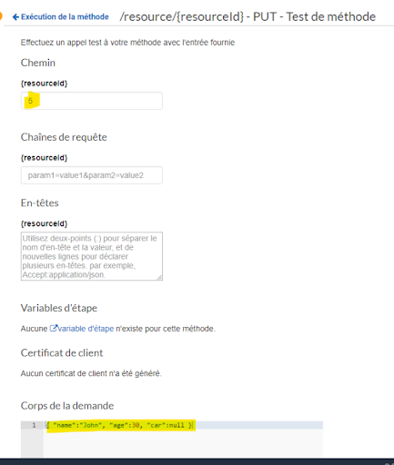
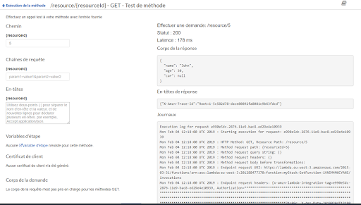

# Créer un service REST en moins de 5mn

Dans cet article nous allons voir comment déployer un service REST en mode serverless sur l’infrastructure AWS.

Le service REST sera une simple interface CRUD permettant de créer, lire et supprimer un enregistrement dans une table d’une base de données.

Trois fonctions seront implémentées : 
* Put : Permettra de stocker un objet en représentation JSON selon un identifiant
* Delete : Permet de supprimer l’objet selon un identifiant
* Get : Permet de récupérer la représentation JSON selon un paramètre id.

Nous allons utiliser différentes ressources AWS :

* AWS::DynamoDB::Table : DynamoDB est une base de données NOSql de type clé valeur. 
* AWS::Lambda : AWS Lambda est un service informatique qui vous permet d'exécuter du code sans nécessiter la mise en service ni la gestion de serveurs. Le code de notre service REST sera implémenté dans 3 fonctions Lambda : GET / DELETE et PUT. Notre implémentation sera écrite en Node.js mais il est possible d’écrire des fonctions dans différents langages (Java, C#, Python, Go).
* AWS::ApiGateway : Permet d’exposer nos fonctions Lambda sous forme de web services REST
* La gestion des droits : AWS::Lambda::Permission et AWS::IAM::Role
AWS CloudFormation qui va nous permettre de décrire notre infrastructure serverless

<blockquote>
Prérequis :

Il faut disposer d’un compte AWS (compte gratuit pendant 1 an)
Installer les outils AWS CLI permettant de déployer notre service en ligne de commande : 
https://docs.aws.amazon.com/fr_fr/cli/latest/userguide/cli-chap-install.html
https://s3.amazonaws.com/aws-cli/AWSCLI64PY3.msi
Sur AWS dans S3 créer un espace de stockage avec toutes les options standard
</blockquote>

Nous allons écrire un script afin de déployer notre service rapidement, et de pouvoir l’adapter afin de créer facilement différents services. AWS CloudFormation permet de créer des “stacks” (ou piles en français) permettant de décrire toute une architecture. Les script sont créés au format YAML ou au format JSON, ici nous allons utiliser la notation YAML.

Voilà le script :

```yml
AWSTemplateFormatVersion: '2010-09-09'
Transform: AWS::Serverless-2016-10-31
Description: Exemple de web service CRUD simple stocké dans DynamoDB.
Resources:
  GetFunction:
    Type: AWS::Serverless::Function
    Properties:
      Handler: index.get
      Runtime: nodejs8.10
      Policies: AmazonDynamoDBReadOnlyAccess
      Environment:
        Variables:
          TABLE_NAME: !Ref Table
      Events:
        GetResource:
          Type: Api
          Properties:
            Path: /resource/{resourceId}
            Method: get
  PutFunction:
    Type: AWS::Serverless::Function
    Properties:
      Handler: index.put
      Runtime: nodejs8.10
      Policies: AmazonDynamoDBFullAccess
      Environment:
        Variables:
          TABLE_NAME: !Ref Table
      Events:
        PutResource:
          Type: Api
          Properties:
            Path: /resource/{resourceId}
            Method: put
  DeleteFunction:
    Type: AWS::Serverless::Function
    Properties:
      Handler: index.delete
      Runtime: nodejs8.10
      Policies: AmazonDynamoDBFullAccess
      Environment:
        Variables:
          TABLE_NAME: !Ref Table
      Events:
        DeleteResource:
          Type: Api
          Properties:
            Path: /resource/{resourceId}
            Method: delete
  Table:
    Type: AWS::Serverless::SimpleTable
```

Quelques explications sur ce fichier :

Les deux premières lignes permettent de préciser l’entête du fichier ainsi que le format utilisé. Nous utilisons “AWS Serverless Application Model (AWS SAM)” qui est une version simplifiée du format de base proposé par CloudFormation
Ensuite on retrouve une simple description de notre stack
Et ensuite on retrouve les ressources qui composent notre service :
* 3 fonctions lamda qui seront accessibles par  l’API REST 
* Une table de données référencée sour le nom de “Table” 

Concernant les fonctions, elles sont définies par :
* Un nom (exemple : GetFunction)
* Un type
* Un handler : Il s’agit du nom du fichier et du de nom de la fonction appelée (voir plus bas)
* Runtime : La language et la version utilisée
* Policies : Le rôle permettant d’accéder à cette fonction
* Environnement : Ici on va référencer la table de la base de donnée utilisée
* Events : Les événements qui vont déclencher l’appel de la fonction, ici il s’agit d’une API HTTP, nous allons donc préciser le chemin et la méthode.

Nous avons donc décrit notre architecture : Une table de base de donnée et 3 fonctions accessibles par une interface REST. Il faut maintenant écrire le code de ces 3 méthodes, dans un fichier qui va se nommer index.js (qui correspond au handler dans la description de la fonction). Notre fichier devra avoir 3 fonctions : get, put et delete.

Voilà le fichier index.js :

```js
'use strict';

console.log('Loading function');
let doc = require('dynamodb-doc');
let dynamo = new doc.DynamoDB();

const tableName = process.env.TABLE_NAME;
const createResponse = (statusCode, body) => {
    return {
        "statusCode": statusCode,
        "body": body || ""
    }
};

exports.get = (event, context, callback) => {
    var params = {
        "TableName": tableName,
        "Key": {
            id: event.pathParameters.resourceId
        }
    };
    
    dynamo.getItem(params, (err, data) => {
        var response;
        if (err)
            response = createResponse(500, err);
        else
            response = createResponse(200, data.Item ? data.Item.doc : null);
        callback(null, response);
    });
};

exports.put = (event, context, callback) => {
    var item = {
        "id": event.pathParameters.resourceId,
        "doc": event.body
    };

    var params = {
        "TableName": tableName,
        "Item": item
    };

    dynamo.putItem(params, (err, data) => {
        var response;
        if (err)
            response = createResponse(500, err);
        else
            response = createResponse(200, null);
        callback(null, response);
    });
};

exports.delete = (event, context, callback) => {

    var params = {
        "TableName": tableName,
        "Key": {
            "id": event.pathParameters.resourceId
        }
    };

    dynamo.deleteItem(params, (err, data) => {
        var response;
        if (err)
            response = createResponse(500, err);
        else
            response = createResponse(200, null);
        callback(null, response);
    });
};
```

On retrouve une instanciation de la base de données ainsi que nos 3 fonctions put, get et delete, le code est assez simple et lisible, prenez un peu de temps pour le lire.

Il faut bien noter que le nom de la table est récupéré depuis le fichier de configuration, donc on pourrait très bien utiliser ce fichier pour n’importe quelle autre table de données : On peut donc, simplement en modifiant le script yaml, créer un nouveau service REST sur une autre table.

Nous allons maintenant déployer notre service sur AWS. Les deux fichiers ci dessus sont à stocker dans un dossier que nous allons appeler SRC_FOLDER.

Dans un premier temps il faut configurer les outils CLI AWS avec la commande :
```sh
> aws configure
```

Il faudra saisir 4 paramètres : ID de clés d’accès et secret de clé d’accès, région d’exécution par défaut et format d’export par défaut : 
* Pour les clés d’accès, vous pouvez les générer depuis https://console.aws.amazon.com/iam/home#/security_credentials dans “Clés d’accès”.
* Région d’exécution : Vous pouvez utiliser eu-west-3 
* Format de sortie : Je préfère le format json.

Ensuite nous allons “compiler” notre fichier de description yaml et le stocker sans AWS S3 : Ouvrir une ligne de commande dans le dossier SRC_FOLDER et lancer la commande : 

```sh
> aws cloudformation package --template-file serverless.yaml --output-template-file new_app_spec.yml --s3-bucket articles-tuto-jerome
```

Serverless.yaml : Correspond au nom de notre fichier yaml
Articles-tuto-jerome : Correspond à l’espace de stockage S3 créé dans les pré requis. 

Ensuite nous allons déployer notre service :
``` sh
 > aws cloudformation deploy --template-file C:\Users\jrauch\Desktop\ART1\new_app_spec.yml --stack-name myStack --capabilities CAPABILITY_IAM
```

mySack correspondra à la pile qui sera créée dans CloudFormation. 

Dans l’interface AWS, sur CloudFormation on peut voir que notre environnement a été créé : 



L’onglet Ressources nous permet de voir les ressources utilisées : 



En cliquant sur la ligne ServerlessRestApi on arrive sur le détail de notre api et sur nos 3 fonctions. 

Un clic par exemple sur la fonction PUT nous permet de tester cette dernière : 



Pour stocker l’id 5 avec l’objet suivant : 
```json
{ "name":"John", "age":30, "car":null }
```



Ensuite nous allons tester la fonction GET pour vérifier que les données ont bien été stockées :



Dans le corps de la réponse on retrouve bien notre objet JSON !

De la même façon vous pouvez tester la fonction DELETE.

Nous avons donc vu comment créer facilement un service REST sur AWS et comment le déployer simplement en ligne de commande.

Je vous invite à découvrir les autres ressources créées par notre script.


